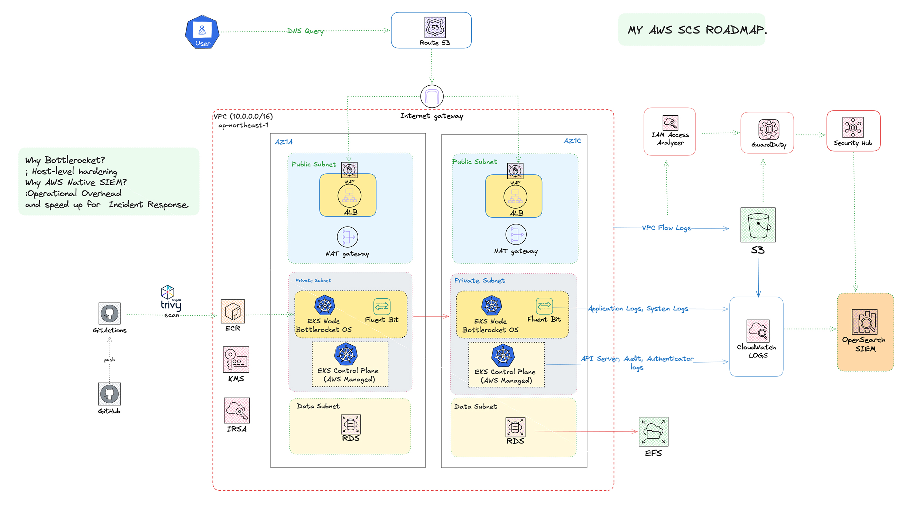

# AWS EKS Hardened Modernization & Security Platform (EP2)

## 🚀 Overview

Migrated 14 legacy web applications (WordPress/Static) from vulnerable shared hosting to a high-security, **Immutable Infrastructure on AWS EKS**, leveraging **Bottlerocket OS** for maximum node-level hardening.

---

## 📜 Background: From "The Walking Dead" to "The Fortress"

This platform is the direct architectural response to **EP1** — a security compromise involving 22 legacy domains on shared hosting caused by cross-site contamination and lack of isolation.

| | |
|---|---|
| **The Incident** | [The-Walking_Dead-22-Domains (EP1)](https://github.com/Jira-saki/The-Walking_Dead-22-Domains) |
| **The Countermeasure** | This Hardened EKS Platform (EP2) |

By analyzing the previous attack vectors (manual SSH access, shared kernels, unmonitored lateral movement), I designed this platform to be **Immutable**, **Zero-SSH**, and **Observable by Default**.

---

## 🏗️ Architecture: The SCS-Infra Blueprint

<div align="center">
  
  <p><sub><i>Figure 1: Immutable Infrastructure & Runtime Security Architecture — EP2 Platform</i></sub></p>
</div>

---

## 🛡️ Core Hardening Strategy

### Host-Level Security (Bottlerocket OS)
- Nodes run on **AWS Bottlerocket** — a purpose-built, container-optimized Linux OS
- **Zero attack surface:** No SSH, no interactive shell, read-only root filesystem by default

### Container & Software Supply Chain
- **Trivy Scanning** — Integrated into GitHub Actions to scan OCI images before pushing to ECR
- **IRSA (IAM Roles for Service Accounts)** — Enforces Least Privilege at the Pod level

### Data Perimeter & Network Isolation
- **3-Tier Multi-AZ VPC:** Public (WAF/ALB) → Private (EKS Nodes) → Data (RDS/EFS)
- **S3 Gateway Endpoints** with strict VPC Endpoint Policies to prevent data exfiltration
  - Allows access only to designated S3 buckets within the account
  - Explicitly denies all cross-account S3 traffic, even if IAM credentials are compromised

---

## 🔍 Native SIEM & Observability

| Component | Role |
|---|---|
| **Fluent Bit** | Collects & routes app, system, and audit logs to CloudWatch |
| **Amazon OpenSearch** | Real-time security analytics and incident response (Native SIEM) |
| **AWS GuardDuty** | Continuous threat detection |
| **Security Hub** | Centralized compliance posture & automated remediation |
| **IAM Access Analyzer** | Detects unintended resource exposure |

---

## 🛠️ Tech Stack

| Layer | Technology |
|---|---|
| Compute | AWS EKS — Managed Node Groups w/ Bottlerocket OS |
| Networking | VPC, ALB, WAFv2, S3 Gateway Endpoint |
| Security | AWS WAF, KMS, GuardDuty, Trivy, IAM Access Analyzer |
| Observability | Fluent Bit, CloudWatch, OpenSearch SIEM |
| IaC | Terraform (Modular Design) |
| CI/CD | GitHub Actions |

---

## 🧩 Terraform Module Structure

```text
📂 Project Root
├── main.tf          # Orchestrates Network, EKS, and Security Tiers
├── variables.tf     # Input variables
├── outputs.tf       # Critical cluster metadata & monitoring endpoints
├── .github/         # CI/CD — Trivy image scanning & Terraform plan
└── modules/
    ├── vpc/         # 3-Tier Multi-AZ network & VPC endpoints
    ├── eks/         # Bottlerocket node groups & OIDC/IRSA setup
    ├── security/    # WAFv2, GuardDuty, and Security Hub automation
    └── logging/     # CloudWatch → OpenSearch (SIEM) pipeline
```

---

## ⚙️ Prerequisites

> _Details will be updated after Terraform coding is complete._

- Terraform `>= 1.x`
- AWS CLI configured with appropriate permissions
- `kubectl` installed

---

## 🚦 Getting Started

> _Setup steps will be updated after Terraform coding is complete._

---

## 💡 Key Security Decisions

> _Detailed rationale for each architectural decision will be updated after Terraform coding is complete._

| Decision | Rationale |
|---|---|
| Bottlerocket OS | |
| Zero-SSH Design | |
| S3 Gateway Endpoint | |
| IRSA over Node IAM Roles | |
| Native SIEM with OpenSearch | |
