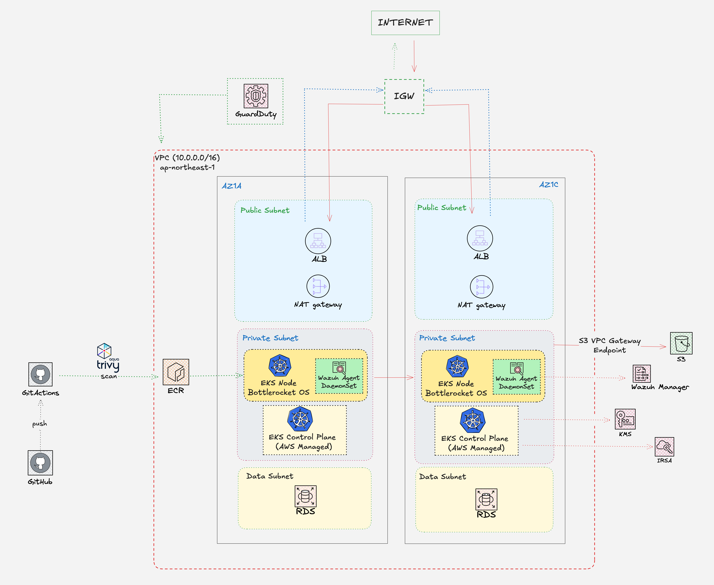

# AWS EKS Hardened Modernization & Security Platform

## 🚀 Overview

Migrating 14 legacy sites (WordPress/Static) from shared hosting to a high-security, immutable AWS EKS platform running Bottlerocket OS.
Born from the lessons learned in 'The Walking Dead' incident response, this platform serves as the immutable destination for migrating legacy workloads into a zero-trust environment.

## 🏗️ Architecture (Phase 1: Ongoing)


<div align="center">
  
  <p align="center">
    <sub><i>Figure 1: Immutable Infrastructure & Runtime Security Architecture for EP2 Platform</i></sub>
  </p>
</div>

- **VPC:** 3-Tier Multi-AZ (Public, Private, Data)
- **Security:** Zero-SSH, Private-only Workloads
- **IaC:** Terraform (Modular)

## 🛡️ Hardened Security Features (Phase 1.2)

### 🛰️ Data Perimeter & Networking

- **S3 Gateway Endpoint:** Private routing to S3 within the VPC — no Internet or NAT traversal, reducing cost and attack surface.
- **Data Exfiltration Prevention:** Strict VPC Endpoint Policy that:
  - Allows access only to designated S3 buckets within the AWS Resource Account.
  - Explicitly denies all cross-account S3 traffic, even if IAM credentials are compromised.
- **3-Tier Network Isolation:**
  - `Public` — ALBs & IGW only.
  - `Private` — EKS Nodes & Workloads (no public IP).
  - `Data` — Isolated database tier, egress via NAT for patching only.

### 🧩 IaC Design Patterns

- **Modular Terraform:** VPC, Endpoints, and Security Groups separated for maintainability.
- **Identity-based Hardening:** `aws_caller_identity` for dynamic, zero-hardcoded account referencing.

## 🛠️ Tech Stack

- AWS (EKS, VPC, S3, Bedrock)
- Terraform
- Kubernetes (CKA Standards)

```text
# [📂 Project Root]

├── 🧱 (1) [Input] Root variables.tf
│   └── var.project_name = "hardened-modernization"
│
├── 🚀 (2) [Orchestrator] Root main.tf
│   │
│   │   # --- Phase 1: Create Network ---
│   ├──> module "vpc" { source = "./modules/vpc" }
│   │   │
│   │   │   # 📂 [modules/vpc/main.tf]
│   │   │   ├──> [aws_vpc.main] (Creates VPC: ID = vpc-12345)
│   │   │   └──> [aws_subnet.private[*]] (Creates Subnets: IDs = ["sn-a", "sn-c"])
│   │   │
│   │   │   # 📂 [modules/vpc/outputs.tf]
│   │   └──> output "vpc_id" = aws_vpc.main.id
│   │   └──> output "private_subnet_ids" = aws_subnet.private[*].id
│   │
│   │   # --- Phase 2: Wiring Data (The Bridge) ---
│   ├──> (3) [Wiring] Data flows via Root main.tf arguments
│   │   ├── vpc_id             = module.vpc.vpc_id             <-- (Get vpc-12345)
│   │   ├── private_subnet_ids = module.vpc.private_subnet_ids <-- (Get ["sn-a", "sn-c"])
│   │   └── cluster_name       = "${var.project_name}-cluster"
│   │
│   │   # --- Phase 3: Create Compute ---
│   └──> module "eks" { source = "./modules/eks" }
│       │
│       │   # 📂 [modules/eks/variables.tf]
│       ├──> (4) [Input] Receives wired data into Module Variables
│       │   ├── var.vpc_id             <-- Receives vpc-12345
│       │   ├── var.private_subnet_ids <-- Receives ["sn-a", "sn-c"]
│       │   └── var.cluster_name       <-- Receives "hardened-modernization-cluster"
│       │
│       │   # 📂 [modules/eks/main.tf]
│       └──> (5) [Compute] Final resources consume variables
│           ├── [aws_eks_cluster.this] -> Uses: var.private_subnet_ids
│           └── [aws_eks_node_group.this] -> Uses: var.private_subnet_ids
│
└── 📤 (6) [Output] Root outputs.tf
    └── output "vpc_id" = module.vpc.vpc_id # (Shows final VPC ID in terminal)
`