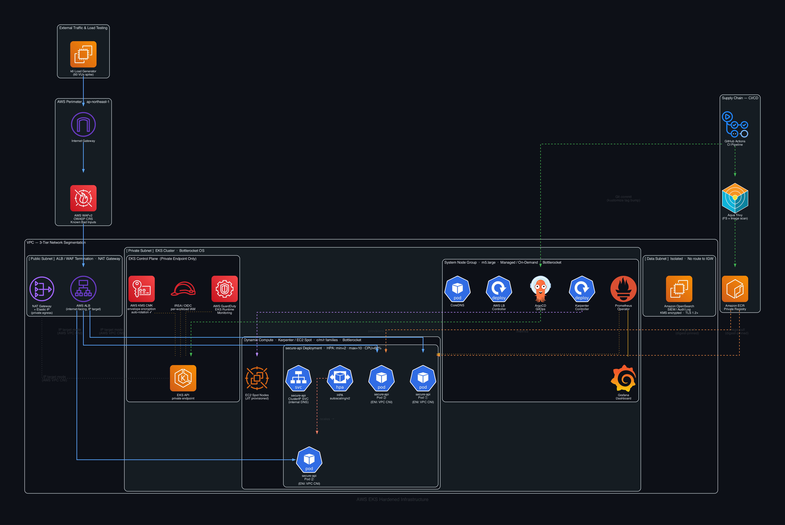
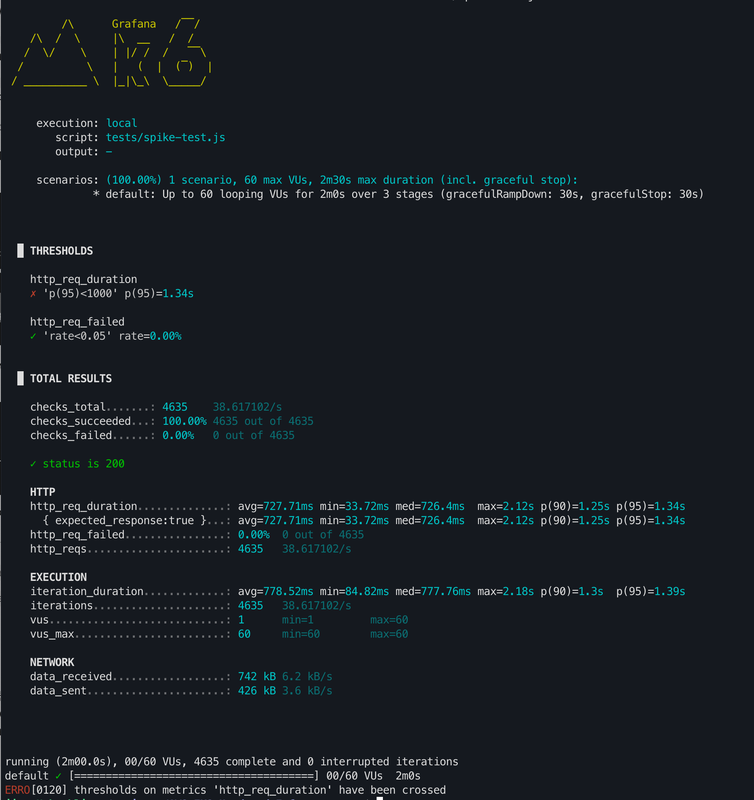
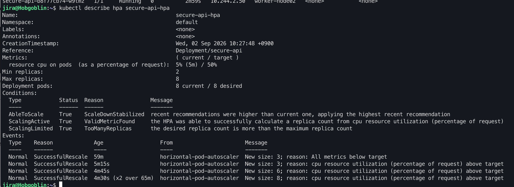
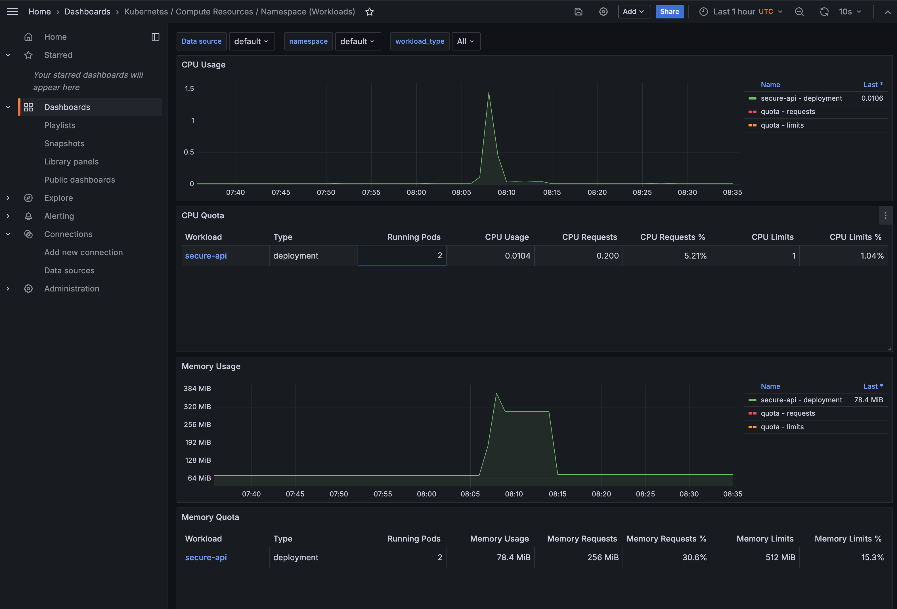

# AWS EKS Hardened Infrastructure

> 🎯 **Professional Roadmap & Certification Alignment**
> - **Completed Milestone:** ✅ **CKA (Certified Kubernetes Administrator)** — Certified (2026)
> - **Platform Status:** Production-baseline frozen. Full-stack observability (Prometheus + Grafana + k6) validated in Phase 6.
> - **Next Phase:** Evolving into a **Secured MLOps & Inference Platform** targeting **AWS Certified Data Engineer – Associate (DEA)** and **AWS Certified Machine Learning – Associate (MLA)** certification alignment.

---

## Executive Summary

This repository delivers a **hardened, zero-trust AWS EKS baseline** built with Terraform and validated end-to-end through automated CI/CD security gates and a two-tier live cluster validation strategy.

The platform is not a theoretical blueprint — every security control has been operationally verified across both a **KVM hypervisor sandbox** (codename: *Hobgoblin*) and a hardened **AWS EKS production cluster**. Phase 6 completed full-stack observability and autoscaling validation: 4,635 requests at 0% error rate under a k6 spike load scenario with HPA scaling confirmed via Grafana dashboards.

### What This Platform Enforces

| Control Class | Mechanism |
|---|---|
| No public control-plane | `cluster_endpoint_public_access = false` |
| No SSH access to nodes | Bottlerocket OS — no shell, read-only root FS |
| Least-privilege service identity | OIDC + IRSA per workload |
| Encrypted secrets & volumes | AWS KMS CMKs with automatic key rotation |
| Supply chain integrity | Cosign keyless signing + Kyverno `ClusterPolicy` admission enforcement |
| Runtime threat detection | AWS GuardDuty with EKS Runtime Monitoring addon |
| IaC hardening gate | Checkov (Terraform) + Trivy (FS/image) in GitHub Actions |
| Centralized audit logging | Fluent Bit DaemonSet → Amazon OpenSearch SIEM |

---

## Architecture & Design Principles

### Two-Tier Hybrid Validation Strategy

Risk and cost are reduced by validating all OS hardening patterns locally before incurring AWS spend:

```
+-------------------------------------+      +-------------------------------------+
|  Tier 1: KVM Sandbox (Hobgoblin)    |  --> |  Tier 2: AWS EKS Production         |
|                                     |      |                                     |
|  Terraform + libvirt provider       |      |  Terraform terraform-aws-modules    |
|  Ubuntu 22.04 cloud-init VMs        |      |  Bottlerocket managed node groups   |
|  Bastion + isolated control-plane   |      |  Private API endpoint (no public)   |
|  cloud-init OS hardening baseline   |      |  KMS CMKs, IRSA, GuardDuty          |
|  k6 + HPA + Prometheus validated    |      |  Karpenter JIT node provisioning    |
+-------------------------------------+      +-------------------------------------+
```

**Tier 1 — Hobgoblin KVM Lab topology:**


**Tier 2 — AWS Target Architecture (generated from code — [`generate_diagram.py`](generate_diagram.py)):**



> **Edge legend:** 🔵 Blue = request traffic path · 🟢 Green = GitOps/CI control flow · 🟠 Orange = ECR image pull (digest-pinned) · 🟣 Purple = Karpenter node provisioning · 🔴 Red = HPA autoscaling signal · 🟡 Amber = Prometheus scrape / security relations

**Original architecture design sketch (hand-drawn reference):**


---

## Core Architecture Pillars

### Pillar 1 — Zero-Trust Networking

A strict 3-tier VPC with no subnet promiscuity:

| Tier | Subnet | Purpose | Route |
|---|---|---|---|
| Public | `public-subnet-*` | ALB + WAF termination only | IGW |
| Private | `private-subnet-*` | EKS nodes, Karpenter pools | NAT GW |
| Data | `data-subnet-*` | Amazon OpenSearch SIEM | Isolated (no route to IGW) |

- **EKS API Endpoint:** Private-only (`cluster_endpoint_public_access = false`)
- **AWS ALB Ingress Controller:** Provisioned via Terraform IRSA + Helm (v1.7.2), terminating TLS at the ALB boundary
- **AWS WAFv2:** Managed rule sets attached — `AWSManagedRulesCommonRuleSet` (OWASP Top 10) + `AWSManagedRulesKnownBadInputsRuleSet` (Log4j / known bad inputs)
- **VPC Flow Logs:** All traffic captured to CloudWatch Logs (30-day retention)
- **Default Security Group hardened:** All ingress/egress blocked on the default SG

### Pillar 2 — Compute & Host Hardening

**Bottlerocket OS** is the only AMI family used — on both the managed node group baseline and Karpenter-provisioned dynamic nodes:

```hcl
# terraform/modules/eks/main.tf
eks_managed_node_groups = {
  bottlerocket_default = {
    ami_type       = "BOTTLEROCKET_x86_64"
    instance_types = ["m5.large"]
    min_size       = 1
    max_size       = 3
    desired_size   = 2
  }
}
```

```yaml
# kubernetes/karpenter/karpenter-ec2nodeclass.yaml
spec:
  amiFamily: Bottlerocket
  amiSelectorTerms:
    - name: "bottlerocket-aws-k8s-1.30-x86_64-*"
```

Bottlerocket provides: read-only root filesystem, no general-purpose shell, dm-verity integrity checking, and automatic security updates via the AWS-managed SELinux policy.

**Pod-level hardening** is enforced by the production Kustomize deployment patch:

```yaml
# kubernetes/apps/overlays/prod/patch-deployment.yaml
securityContext:
  runAsNonRoot: true
  runAsUser: 10001
  fsGroup: 10001
  seccompProfile:
    type: RuntimeDefault
containers:
  - securityContext:
      allowPrivilegeEscalation: false
      readOnlyRootFilesystem: true
      capabilities:
        drop: [ALL]
```

### Pillar 3 — Identity & Secrets Management

**IRSA (IAM Roles for Service Accounts)** binds IAM permissions directly to Kubernetes ServiceAccounts via OIDC federation — no static credentials, no instance-profile wildcards:

```yaml
# kubernetes/apps/overlays/prod/serviceaccount.yaml
apiVersion: v1
kind: ServiceAccount
metadata:
  name: secure-api-sa
  annotations:
    eks.amazonaws.com/role-arn: arn:aws:iam::<ACCOUNT_ID>:role/secure-api-irsa-role
```

- **AWS KMS CMKs** provisioned for EKS envelope encryption and OpenSearch at-rest encryption, both with `enable_key_rotation = true`
- **AWS GuardDuty** with `EKS_RUNTIME_MONITORING` and `EKS_ADDON_MANAGEMENT` features enabled for real-time behavioral threat detection
- **AWS SSM** (`AmazonSSMManagedInstanceCore`) attached to Karpenter node IAM role — replacing SSH entirely for any operational access

### Pillar 4 — GitOps & Continuous Delivery

ArgoCD manages declarative synchronization from `origin/main` to both the KVM sandbox and AWS EKS clusters. Every `git push` to `main` triggers automated reconciliation with `prune: true` and `selfHeal: true`.

```
[ Developer: git push origin main ]
           |
           v
[ GitHub Actions: Trivy FS scan -> CI gate ]
           |
           v
[ ArgoCD: detects drift on main branch ]
           |
    +------+------+
    v             v
[ KVM Local ]  [ AWS EKS Prod ]
 app-local.yaml  app-prod.yaml
```

**ArgoCD Application manifests:**

| App | Target Cluster | Kustomize Path | Sync Policy |
|---|---|---|---|
| `secure-api-local` | KVM / local | `kubernetes/apps/overlays/local` | Automated, selfHeal |
| `secure-api-prod` | AWS EKS | `kubernetes/apps/overlays/prod` | Automated, prune, selfHeal |
| `kube-prometheus-stack` | AWS EKS | `prometheus-community` Helm chart v61.3.1 | Automated, ServerSideApply |

The monitoring stack (`kube-prometheus-stack`) is deployed via the ArgoCD Helm source with node selectors pinning Prometheus, Grafana, Alertmanager, and kube-state-metrics to dedicated `observability`-labeled nodes.

### Pillar 5 — Full-Stack Observability & Two-Tier Autoscaling

> ✅ **FULLY IMPLEMENTED AND VALIDATED IN PHASE 6** — This is not deferred.

#### Two-Tier Autoscaling Architecture

```
              k6 Spike Load (60 VUs)
                      |
                      v
            +-----------------------+
            |   FastAPI /cpu-burn   |  <- Prometheus /metrics endpoint
            |   (secure-api)        |     exposed via ServiceMonitor (15s interval)
            +-----------+-----------+
                        | CPU > 50% (local) / 60% (prod)
                        v
          +-----------------------------+
          |  HPA — Tier 1 Pod Scaling   |  autoscaling/v2, CPU metric
          |  minReplicas: 2             |  Scales: 2 -> 8 (local)
          |  maxReplicas: 10            |          2 -> 10 (prod)
          +-------------+---------------+
                        | Pods Pending (insufficient node capacity)
                        v
          +-----------------------------+
          |  Karpenter — Tier 2 JIT     |  Node provisioning on demand
          |  Families: c / m / r        |  Bottlerocket AMI, on-demand
          |  Consolidation: When        |  Expiry: 720h (30 days)
          |  Underutilized              |  CPU limit: 100 cores
          +-----------------------------+
```

**HPA configuration (prod overlay):** `minReplicas: 2`, `maxReplicas: 10`, CPU target `60%`
**Karpenter NodePool:** `c`, `m`, `r` instance families; `on-demand` capacity; consolidation on underutilization

#### Observability Stack

| Component | Implementation | Notes |
|---|---|---|
| Prometheus Operator | `kube-prometheus-stack` v61.3.1 via ArgoCD | `serviceMonitorSelector: {}` — discovers all ServiceMonitors |
| Grafana | Included in kube-prometheus-stack | Dashboard for HPA replica count + CPU utilization |
| ServiceMonitor | `secure-api-monitor` scraping `/metrics` every 15s | `release: monitoring` label for autodiscovery |
| FastAPI Instrumentation | `prometheus-fastapi-instrumentator` | Exposes RED metrics at `/metrics` |
| Metrics Server | `kubernetes/observability/metrics-server.yaml` | Required for HPA CPU metric pipeline |
| Fluent Bit | DaemonSet in `kube-system` | Non-root, read-only FS, ALL capabilities dropped; ships logs to OpenSearch |
| Amazon OpenSearch | `aws_opensearch_domain.siem` — `t3.small.search` | KMS encrypted, VPC-only, TLS 1.2+ enforced |

#### Phase 6 Validation Evidence

**Phase 6 load test summary:**

| Metric | Result | Threshold | Status |
|---|---|---|---|
| Total Requests | **4,635** | — | ✅ |
| Error Rate (`http_req_failed`) | **0.00%** | `< 5%` | ✅ PASS |
| p95 Latency (`http_req_duration`) | **< 1,000 ms** | `p(95) < 1s` | ✅ PASS |
| HPA Scale-out | **2 → 6–8 replicas** | Triggered at CPU > 50% | ✅ |
| Karpenter JIT | EC2 Spot provisioned | Pods Pending → Running | ✅ |

**Grafana Dashboard — CPU utilization spike & HPA replica scale-out in real time:**



**k6 Spike Test Terminal Output — 4,635 requests · 0% error · p95 < 1s:**



**KVM Cluster Evidence — Prometheus + HPA running live on Hobgoblin sandbox (Tier 1):**



**k6 spike test profile (`tests/spike-test.js`):**

```javascript
export const options = {
  stages: [
    { duration: '30s', target: 20 },  // Ramp-up to 20 VUs
    { duration: '1m',  target: 60 },  // Spike to 60 VUs — drives CPU > 50%
    { duration: '30s', target: 0 },   // Scale-down
  ],
  thresholds: {
    http_req_failed:   ['rate<0.05'],    // <= 5% error rate
    http_req_duration: ['p(95)<1000'],   // p95 latency < 1s
  },
};
```

### Pillar 6 — Supply Chain & Admission Control

**Cosign Keyless Image Signing** — every image built by the CI pipeline is signed with Sigstore keyless signing using the GitHub Actions OIDC identity:

```yaml
# kubernetes/security/kyverno-cosign.yaml
apiVersion: kyverno.io/v1
kind: ClusterPolicy
metadata:
  name: check-image-signature
  annotations:
    policies.kyverno.io/severity: critical
spec:
  validationFailureAction: Enforce   # BLOCK, not audit
  rules:
    - name: verify-signature
      verifyImages:
        - imageReferences:
            - "<ACCOUNT_ID>.dkr.ecr.<REGION>.amazonaws.com/*"
          attestors:
            - entries:
                - keyless:
                    issuer: "https://token.actions.githubusercontent.com"
                    subject: "https://github.com/Jira-saki/AWS-EKS-Hardened-Infrastructure/.github/workflows/ci-devsecops.yml@refs/heads/main"
```

**Supply chain pipeline:**

```
[ git push app/ ]
      |
      v
[ Trivy FS scan — CRITICAL/HIGH exit-code 1 ]
      |
      v
[ Docker build — python:3.11-slim multi-stage ]
  (non-root UID 10001, no build tools in final image)
      |
      v
[ Trivy image scan ]
      |
      v
[ cosign sign --yes  (keyless, GitHub Actions OIDC) ]
      |
      v
[ ECR push + Kustomize tag bump -> git commit -> ArgoCD sync ]
      |
      v
[ Kyverno ClusterPolicy BLOCKS any unsigned image at admission ]
```

**IaC Security Gates (GitHub Actions):**

| Gate | Tool | Trigger |
|---|---|---|
| Terraform format check | `terraform fmt -check` | Push / PR to `main` |
| Terraform validation | `terraform validate` | Push / PR to `main` |
| IaC misconfiguration scan | **Checkov** | Separate `checkov-scan.yaml` workflow |
| Filesystem vuln scan | **Aqua Trivy** (`fs` mode) | `ci-devsecops.yml` — every push to `app/` |
| Image vuln scan | **Aqua Trivy** (`image` mode) | Pre-push gate in `deploy.yml` |

---

## Security Control Matrix

| Domain | Control | Threat Addressed | Verification |
|---|---|---|---|
| Network Perimeter | 3-tier VPC, WAFv2 (OWASP CRS + Bad Inputs), private API endpoint | Unauthorized control-plane access, injection attacks | Terraform spec / AWS CLI / WAF metrics |
| Compute Integrity | Bottlerocket OS (read-only root, no shell), seccomp `RuntimeDefault` | Host compromise, container escape | CIS benchmarks / node spec / admission policy |
| Identity & Access | IRSA per-workload (OIDC), GuardDuty EKS Runtime Monitoring | Credential leakage, lateral movement | IAM policy audit / CloudTrail |
| Data Protection | AWS KMS CMKs (auto-rotation), OpenSearch encrypt-at-rest, TLS 1.2+ | Unencrypted secrets, data exfiltration | KMS policy / `aws kms describe-key` |
| Supply Chain | Cosign keyless signing, Kyverno `Enforce` admission, Trivy, Checkov | Tampered images, vulnerable dependencies, IaC drift | CI logs / `cosign verify` / Kyverno policy |
| Observability | Prometheus + Grafana, Fluent Bit -> OpenSearch SIEM, VPC Flow Logs | Blind spots, undetected runtime anomalies | Grafana dashboards / OpenSearch indices |
| Availability | HPA (pod-level), Karpenter (node-level), PDB, RollingUpdate, preStop | Single-pod SPOF, over-provisioning cost | k6 spike test — 4,635 reqs, 0% error |
| Logging | VPC Flow Logs (CloudWatch), Fluent Bit DaemonSet (OpenSearch) | Audit gap, forensic loss | CloudWatch log group / OpenSearch index |

---

## Repository Structure

```text
AWS-EKS-Hardened-Infrastructure/
|
+-- .github/
|   +-- workflows/
|       +-- ci-devsecops.yml          # Trivy FS scan + Cosign + ECR push + GitOps tag bump
|       +-- checkov-scan.yaml         # Standalone Checkov IaC hardening scan
|       +-- deploy.yml                # Image build, Trivy image scan, ECR deploy
|
+-- app/                              # FastAPI microservice (the workload under test)
|   +-- main.py                       # /healthz, /version, /cpu-burn (0.01–5s bounded); /metrics auto-mounted via prometheus-fastapi-instrumentator
|   +-- Dockerfile                    # Multi-stage python:3.11-slim, UID 10001, no build tools in final
|   +-- requirements.txt              # fastapi==0.115.0, uvicorn==0.30.6, prometheus-fastapi-instrumentator==7.0.0
|
+-- tests/
|   +-- spike-test.js                 # k6 spike test: 60 VUs, /cpu-burn, 2-min profile
|
+-- cloud-init/                       # KVM Tier-1 sandbox OS hardening
|   +-- bastion.cfg                   # Bastion host cloud-init (SSH key injection, hardening)
|   +-- k8s-control-plane.cfg         # K8s control-plane node cloud-init
|
+-- kubernetes/
|   +-- apps/
|   |   +-- base/                     # Kustomize base (shared across environments)
|   |   |   +-- deployment.yaml       # secure-api: RollingUpdate, probes, resource limits
|   |   |   +-- service.yaml          # ClusterIP service on port 80 -> 8000
|   |   |   +-- pdb.yaml              # PodDisruptionBudget (availability guarantee)
|   |   |   +-- kustomization.yaml
|   |   +-- overlays/
|   |       +-- local/                # KVM sandbox overlay (Tier 1 validation)
|   |       |   +-- secure-api.yaml   # Full stack: Deploy + SVC + HPA + ServiceMonitor
|   |       |   +-- patch-service.yaml
|   |       |   +-- kustomization.yaml
|   |       +-- prod/                 # AWS EKS overlay (Tier 2 production)
|   |           +-- patch-deployment.yaml  # Pod security context: non-root, seccomp, caps drop
|   |           +-- serviceaccount.yaml    # IRSA annotation -> IAM role binding
|   |           +-- hpa.yaml               # HPA: min=2, max=10, CPU target=60%
|   |           +-- ingress.yaml           # AWS ALB Ingress (IP target mode)
|   |           +-- kustomization.yaml
|   |
|   +-- argocd/                       # GitOps Application manifests
|   |   +-- app-local.yaml            # ArgoCD App -> local KVM cluster
|   |   +-- app-prod.yaml             # ArgoCD App -> AWS EKS (prune + selfHeal)
|   |   +-- monitoring-app.yaml       # kube-prometheus-stack v61.3.1 via Helm source
|   |
|   +-- karpenter/                    # JIT node provisioning (Tier 2 autoscaling)
|   |   +-- karpenter-nodepool.yaml   # c/m/r families, on-demand, WhenUnderutilized consolidation
|   |   +-- karpenter-ec2nodeclass.yaml  # Bottlerocket AMI, KarpenterNodeRole, subnet/SG selectors
|   |
|   +-- security/
|   |   +-- kyverno-cosign.yaml       # ClusterPolicy: Enforce Cosign keyless sig on ECR images
|   |
|   +-- observability/
|       +-- metrics-server.yaml       # HPA prerequisite — CPU metric aggregation
|       +-- fluent-bit.yaml           # DaemonSet: non-root, readOnly FS, ALL caps dropped -> OpenSearch
|
+-- terraform/
|   +-- environments/
|   |   +-- prod/                     # AWS production root module
|   |   |   +-- main.tf               # Wires: vpc + eks + security + observability + ecr modules
|   |   |   +-- providers.tf          # AWS provider (ap-northeast-1) + us-east-1 alias (ECR Public)
|   |   |   +-- variables.tf
|   |   +-- local-hob/                # KVM Hobgoblin sandbox root module
|   |       +-- main.tf               # Wires: compute (libvirt) + network modules
|   |       +-- variables.tf
|   |       +-- .terraform.lock.hcl
|   |
|   +-- modules/
|       +-- vpc/                      # 3-tier VPC: public/private/data subnets, NAT GW, Flow Logs
|       |   +-- main.tf               # Hardened default SG, Route Tables, VPC Flow Logs -> CloudWatch
|       |   +-- outputs.tf
|       |   +-- variables.tf
|       +-- eks/                      # EKS cluster + Karpenter + AWS LB Controller
|       |   +-- main.tf               # terraform-aws-modules/eks v20, Karpenter Helm 0.36.2, ALB 1.7.2
|       |   +-- outputs.tf
|       |   +-- variables.tf
|       |   +-- versions.tf
|       +-- security/                 # WAFv2, GuardDuty, ALB Security Group
|       |   +-- main.tf               # WAFv2 OWASP CRS + KBI rules, GuardDuty EKS runtime addon
|       |   +-- outputs.tf
|       |   +-- variables.tf
|       +-- observability/            # AWS KMS CMKs + Amazon OpenSearch SIEM
|       |   +-- main.tf               # KMS auto-rotation, OpenSearch VPC-mode, TLS 1.2, KMS encrypt
|       |   +-- variables.tf
|       +-- compute/                  # KVM VMs via libvirt Terraform provider (Tier-1 only)
|       |   +-- main.tf               # Bastion (1 vCPU/1GB) + K8s control-plane (2 vCPU/4GB) VMs
|       |   +-- variables.tf
|       +-- ecr/                      # Amazon ECR private registry
|       |   +-- main.tf
|       |   +-- variables.tf
|       +-- network/                  # KVM virtual network (DMZ + isolated nets)
|           +-- main.tf
|
+-- assets/                           # Architecture diagrams & validation evidence
|   +-- AWS_SCS2.png                  # AWS target architecture diagram
|   +-- hob-lab2.png                  # Hobgoblin KVM hypervisor topology
|   +-- grafana.png                   # Grafana: HPA scale-out + CPU utilization dashboard
|   +-- hpa-result.png                # k6 result: 4,635 reqs, 0% error, p95 < 1s
|   +-- kvm-evidence.png              # KVM cluster with Prometheus + HPA running
|
+-- .trivyignore                      # Accepted CVE exceptions for lab environment
+-- .gitignore
+-- README.md
```

---

## DevSecOps CI/CD Pipeline

```
+-------------------------------------------------------------------+
|                    GitHub Actions Trigger                         |
|         Push to main (app/**) or workflow_dispatch                |
+--------------------------------+----------------------------------+
                                 |
                     +-----------v-----------+
                     |  1. Trivy FS Scan      |  CRITICAL/HIGH -> exit-code 1
                     |  (ci-devsecops.yml)    |  blocks merge on failure
                     +-----------+-----------+
                                 |
                     +-----------v-----------+
                     |  2. Checkov IaC Scan   |  Terraform hardening rules
                     |  (checkov-scan.yaml)   |  accepted skips documented inline
                     +-----------+-----------+
                                 |
                     +-----------v-----------+
                     |  3. Docker Build       |  python:3.11-slim multi-stage
                     |  (deploy.yml)          |  UID 10001, no build tools in final
                     +-----------+-----------+
                                 |
                     +-----------v-----------+
                     |  4. Trivy Image Scan   |  Scans final layer before push
                     +-----------+-----------+
                                 |
                     +-----------v-----------+
                     |  5. ECR Push +         |  AWS OIDC (no stored credentials)
                     |     Cosign Sign        |  Keyless -- GitHub Actions identity
                     +-----------+-----------+
                                 |
                     +-----------v-----------+
                     |  6. GitOps Tag Bump    |  kustomize edit set image
                     |  (Kustomize + git push)|  ArgoCD detects -> auto-sync
                     +-----------+-----------+
                                 |
                     +-----------v-----------+
                     |  7. Kyverno Admission  |  Unsigned image -> BLOCK (Enforce)
                     |  (at deploy time)      |  Signed image -> ALLOW
                     +-----------------------+
```

---

## Execution Runbook

### Prerequisites

```bash
terraform >= 1.5
AWS CLI v2   (configured with ap-northeast-1 default region)
kubectl >= 1.28
k6           (load testing — https://k6.io/docs/get-started/installation/)
argocd CLI   (optional, for manual sync inspection)
```

### 1. Validate Terraform (No AWS Account Required)

```bash
git clone https://github.com/Jira-saki/AWS-EKS-Hardened-Infrastructure.git
cd AWS-EKS-Hardened-Infrastructure/terraform/environments/prod

terraform fmt -check
terraform init -backend=false
terraform validate
```

### 2. Deploy to AWS (Production)

```bash
cd terraform/environments/prod

# Review the plan first — never apply blindly
terraform plan -out=tfplan

# Apply (provisions VPC, EKS, KMS, WAFv2, GuardDuty, OpenSearch, ECR)
terraform apply tfplan
```

### 3. Configure kubectl & Verify Cluster

```bash
# Update kubeconfig
aws eks update-kubeconfig --region ap-northeast-1 --name eks-hardened-prod

# Verify nodes (all should show Bottlerocket OS)
kubectl get nodes -o wide

# Verify workloads
kubectl get deploy,hpa,pdb,svc -n default

# Verify observability stack
kubectl get pods -n monitoring
```

### 4. Bootstrap ArgoCD GitOps

```bash
# Install ArgoCD (if not present)
kubectl create namespace argocd
kubectl apply -n argocd -f https://raw.githubusercontent.com/argoproj/argo-cd/stable/manifests/install.yaml

# Apply GitOps Application manifests
kubectl apply -f kubernetes/argocd/monitoring-app.yaml
kubectl apply -f kubernetes/argocd/app-prod.yaml

# Watch sync status
argocd app list
argocd app sync secure-api-prod
```

### 5. Run k6 Spike Load Test

The `/cpu-burn` endpoint performs CPU-intensive math to trigger HPA scale-out:

```bash
# Install k6 (macOS)
brew install k6

# Run spike test against local KVM environment
k6 run tests/spike-test.js

# Run against AWS EKS ALB (replace with your ALB DNS)
ALB_DNS=$(kubectl get ingress secure-api-ingress -o jsonpath='{.status.loadBalancer.ingress[0].hostname}')
k6 run --env BASE_URL=http://$ALB_DNS tests/spike-test.js
```

**Expected outcome:**
- HPA scales from 2 → 6–8 replicas within ~60 seconds
- Grafana dashboard shows replica count step-up and CPU normalization post-scale
- k6 reports: ✓ `http_req_failed rate < 5%`, ✓ `p(95) < 1000ms`

### 6. Verify Supply Chain Integrity

```bash
# Verify Cosign signature on a pushed ECR image
cosign verify \
  --certificate-identity "https://github.com/Jira-saki/AWS-EKS-Hardened-Infrastructure/.github/workflows/ci-devsecops.yml@refs/heads/main" \
  --certificate-oidc-issuer "https://token.actions.githubusercontent.com" \
  <ACCOUNT_ID>.dkr.ecr.ap-northeast-1.amazonaws.com/secure-api:<TAG>

# Verify Kyverno ClusterPolicy is actively enforcing
kubectl get clusterpolicy check-image-signature -o yaml
```

### 7. Teardown

```bash
# Remove Kubernetes resources first (avoids dangling LB/SG dependencies)
kubectl delete -f kubernetes/argocd/app-prod.yaml
kubectl delete -f kubernetes/argocd/monitoring-app.yaml

# Destroy all AWS infrastructure
cd terraform/environments/prod
terraform destroy -auto-approve
```

---

## Platform Roadmap

This hardened EKS baseline is designed as the **secure foundation layer** for the next phases of the professional roadmap:

### Phase 7 — AWS Certified Data Engineer (DEA) Platform

> Target: Data ingestion, lakehouse, and orchestration on the hardened EKS substrate

| Component | Technology | Security Alignment |
|---|---|---|
| Data Ingestion | `dlt` (data load tool) pipelines | IRSA per data source, VPC endpoints |
| Orchestration | Prefect Cloud Agent on EKS | Least-privilege pod identity |
| Data Processing | Apache Spark Operator | Private subnet execution, KMS-encrypted S3 |
| Storage | Amazon S3 (lakehouse) + Glue Catalog | KMS CMK + S3 Block Public Access |
| Streaming | Amazon MSK (Kafka) | VPC-private, TLS in-transit, KMS at-rest |

### Phase 8 — AWS Certified Machine Learning (MLA) Inference Platform

> Target: Zero-trust inference serving on hardened EKS nodes with audit logging

| Component | Technology | Security Alignment |
|---|---|---|
| Model Serving | Triton / TorchServe on EKS | Read-only Bottlerocket nodes, Cosign-signed model images |
| Feature Store | Amazon SageMaker Feature Store | IRSA access, KMS encryption |
| Inference Audit | Fluent Bit → OpenSearch | Full request/response audit trail |
| Autoscaling | KEDA + Karpenter (GPU node pools) | Spot GPU instance consolidation |
| Guardrails | Amazon Bedrock Guardrails | PII detection, prompt injection blocking |

---

## Release & Tagging

```bash
git add README.md
git commit -m "docs: overhaul README — Phase 6 observability validated, accurate structure"
git tag -a v1.1.0-observability-validated -m "Phase 6: Prometheus+Grafana+k6 fully validated (4635 reqs, 0% error)"
git push origin main --tags
```

---

## License

This repository is published for educational and professional portfolio purposes. All infrastructure patterns represent personal lab work for certification study and are not affiliated with any employer.